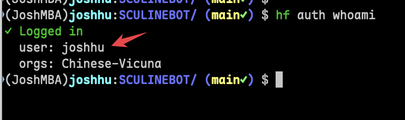
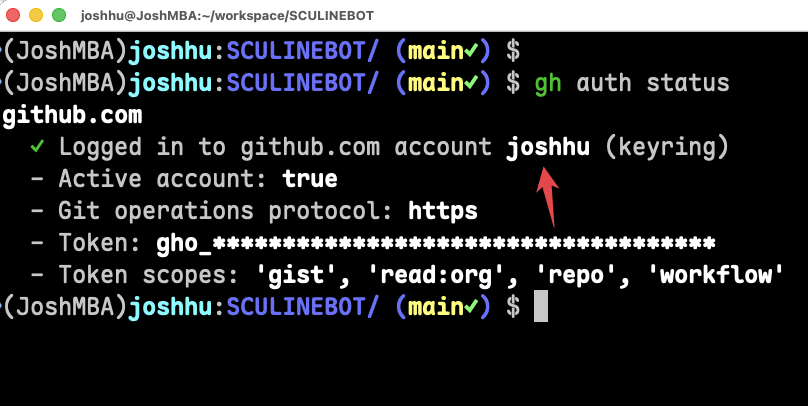

# Windows 同學整個課程的詳細操作步驟

## 一、需要準備的帳號及服務

- LINE Official Account
- GitHub
- Hugging Face
- Supabase
- Google 帳號
- Coding Agent 如 
    - ChatGPT Plus/Pro
    - Gemini Pro
    - Claude Pro/Max


## 二、需要準備的金鑰、憑證

- LINE CHANNEL SECRET
- LINE CHANNEL ACCESS TOKEN
- Hugging Face Access Token
- Supabase Access Token
- 如需使用 AI 功能，需要 Gemini API Key 或 OpenAI API Key

## 三、需要安裝的工具

- uv
- hf
- gh
- brew（用於安裝 gh）
- claude/antigravity/codex 任一，IDE、CLI、或 APP 版本均可

## 四、步驟說明

### 1. 安裝 uv
1. 開啟終端機
2. 輸入 `curl -LsSf https://astral.sh/uv/install.sh | sh` 並按下 Enter 鍵
3. 在終端機中輸入 `uv --version` 確認安裝成功

### 2. 安裝 hf
1. 開啟終端機
2. 輸入 `curl -LsSf https://hf.co/cli/install.sh | bash` 並按下 Enter 鍵
3. 在終端機中輸入 `hf --version` 確認安裝

### 3. 安裝 gh
1. 開啟終端機中
2. 輸入 `brew install gh` 並按下 Enter 鍵
3. 在終端機中輸入 `gh --version` 確認安裝

### 4. 安裝 Coding Agent
1. Claude Code：在終端機中輸入`curl -fsSL https://claude.ai/install.sh | bash`並按下 Enter 鍵
2. Codex ：在終端機中輸入`curl -fsSL https://chatgpt.com/codex/install.sh | sh`並按下 Enter 鍵
3. Antigravity：在這邊下載並安裝：https://antigravity.google/download

## 五、在 CLI 中登入各服務

### 1. 登入 Hugging Face
1. 先在 HuggingFace 的網站上取得你的 Access Token
2. 在終端機中輸入 `hf auth login --force` 並按下 Enter 鍵
3. 在提示中輸入你的 Hugging Face Access Token 並按下 Enter 鍵
4. 確認登入成功，輸入 `hf auth whoami` 查看你的帳號資訊，出現名字就對了。


### 2. 登入 GitHub
1. 在終端機中輸入 `gh auth login` 並按下 Enter 鍵
2. 選擇登入方式（建議使用瀏覽器登入）
3. 按照提示完成登入流程
4. 確認登入成功，輸入 `gh auth status` 查看你的帳號資訊，出現名字就對了。


## 六、準備專案資料夾

### 1. 專案資料夾目錄
1. 在你的家目錄下的 `workspace/SCULINEBOT` 目錄下
2. 基礎檔案為本 GitHub Repo 中 `Code/sculinebot2026` 的程式

### 2. 在專案資料夾中建立 .env 檔案
1. 在 VS Code 中新增一個檔案 `.env`，並將以下內容填入對應的金鑰和憑證：
```
GEMINI_API_KEY="<你的 Gemini API Key>"
SUPABASE_ACCESS_TOKEN="<你的 Supabase Access Token>"
LINE_CHANNEL_ACCESS_TOKEN="<你的 LINE CHANNEL ACCESS TOKEN>"
LINE_CHANNEL_SECRET="<你的 LINE CHANNEL SECRET>"
```
